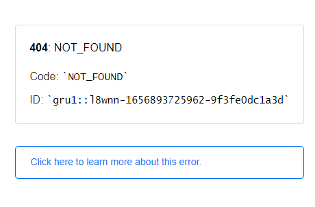
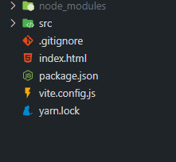
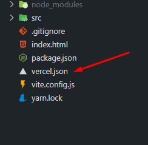

<h1 >
  Corrigindo problema de Deep Linking no deploy utilizando as tecnologias Vite/Vercel
</h1>

## **Detalhando o problema**

<p>Descobri recentemente que a interação entre Vite e Vercel possui um problema de navegação direta (Deep Linking) no deploy da aplicação. Na maioria dos meus últimos projetos eu me deparei com esse problema, mas em alguns não ocorreu, ainda não descobri o motivo exato. O problema em si não ocorre em localHost, mas se manifesta na versão final de deploy do Vercel. Basicamente se o usuário tentar acessar uma rota digitando pela barra de busca do navegador na própria URL, ou atualizando a página em uma rota que não seja a '/' (home do projeto), o vercel apresenta um erro de "404 - Not_Found". Porém se o usuário acessar e navegar pelas rotas através de botões ou links que os direcionam, o erro não se manifesta. Ou seja, é exclusivo dos casos de atualização de página e tentativa de acessar a rota manualmente pela barra de busca.</p>

<h3> Essa é a mensagem de erro que aparece no navegador :</h3>



<hr>

## **Resolvendo o problema:**

<p>A solução que eu encontrei para o problema foi inserir um arquivo no root do projeto com  a configuração do vercel para sobscrever algumas definições padrões de rota.
</p>

Conteúdo do arquivo:

```json
{
  "rewrites": [{ "source": "/(.*)", "destination": "/" }]
}
```

<h2>Passo a passo para corrigir o problema: </h2>

<p> Estou disponibilizando nesse repositório o arquivo que precisa ser baixado e colado na root do seu projeto, após o download, insira na pasta e pronto.</p>

<h3>Antes da alteração: </h3>


<h3>Depois da alteração: </h3>


<!-- width="400" height="400" -->
<!--  -->

<hr>

## **Observações finais:**

<p>
    Após a inserção do arquivo na pasta, o deploy precisa ser atualizado para subir as alterações e corrigir o problema em questão. Segue abaixo o comando do vercel para atualizar o deploy. 
</p>

```json
vercel --prod
```

<p>
    O processo demora cerca de 1 minuto. A nova versão do deploy será atualizada e mantida na mesma URL inicial.
</p>
